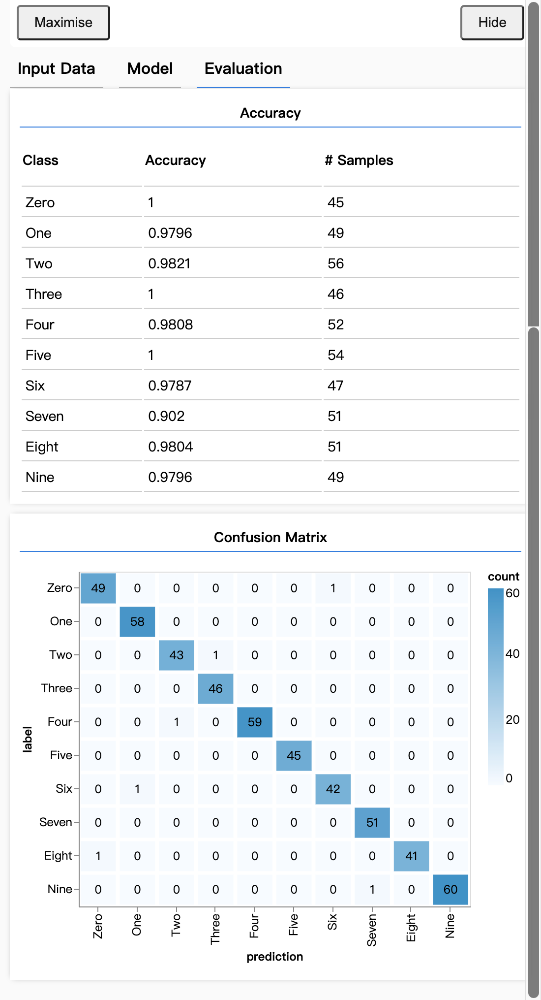
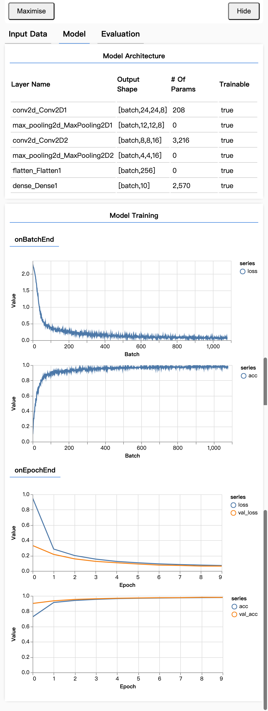

# TensorFlow.js - 使用 CNN 识别手写数字

学习代码,按照 ** [使用 CNN 识别手写数字](https://codelabs.developers.google.com/codelabs/tfjs-training-classfication/index.html?hl=zh-cn#0)** 教程编写的代码,教程本身包含所有代码及其说明.此仓促仅用作记录此次实验的过程

为了提供数据集在web中的利用效率,数据集被打包成了精灵图片.就是按照固定的位置所有的28*28的图片都被写在了一张图片里面.这有利于加载不同图片资源时的内存开销.
识别手写数字的,该问题是典型的监督学习类型.

## 训练结果

## 总结
分类任务需要使用适当的数据表示法来显示标签。
- 标签的常见表示法包括对类别进行独热编码
准备数据：

- 将模型在训练期间从未见过并且您可以用于评估模型的一些数据单独保存会很有帮助。这称为验证集。
构建并运行您的模型：

- 事实证明，卷积模型很适合处理图片任务。
- 分类问题通常使用分类交叉熵作为其损失函数。
- 监控训练，看看损失是否减少，准确率是否上升。
评估模型

- 确定一些方式，在模型经过训练后对其进行评估，以了解其在处理您要解决的最初问题时表现如何。
- 每个类准确率和混淆矩阵可以为您提供比整体准确率更详细的模型性能。

>学习资料 [【机器学习】sklearn特征编码之独热编码（哑编码）](https://www.bilibili.com/video/BV1SQ4y1A7pW?spm_id_from=333.337.search-card.all.click&vd_source=341d2095862f4c14cb9486d5c7ad1976)